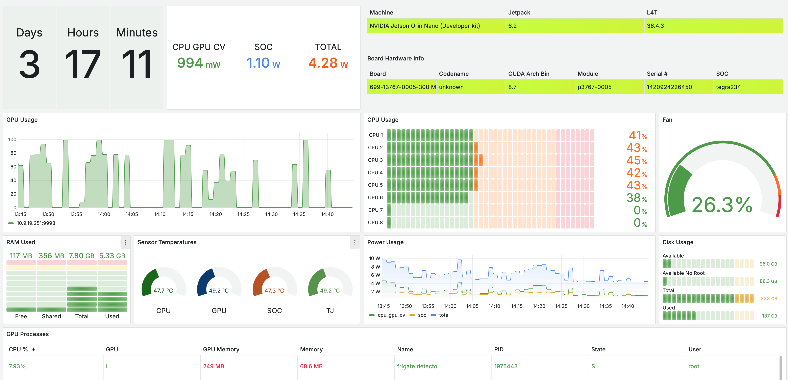

# jetson-stats-grafana-dashboard

## Introduction
This project is a Grafana dashboard, driven by a Prometheus metrics collector, for monitoring NVIDIA Jetson devices Orin Nano operating autonomously in a `headless` fashion (i.e. no connected display and associated user-input devices).



---

## Prerequisites

The following hardware and software should already be configured and operational:

- NVIDIA Jetson Orin Nano device, please test this in another Jetson model and make PR if possible
- A host running [Grafana](https://grafana.com/) 
- A host running [Prometheus](https://prometheus.io/)

---

## Installation

### Jetson Device

1. Ensure `jetson_stats` is installed on your Jetson device. Full instructions can be found on the project [GitHub repo](https://github.com/rbonghi/jetson_stats)

2. Next, install the Prometheus metrics collector

	```bash
	nvidia@agx-desktop $ pip install prometheus-client
	nvidia@agx-desktop $ sudo cp jetson_stats_prometheus_collector.py /usr/local/bin/
	```

3. Install the Prometheus metrics collector as a system background `systemd` service

	```bash
	nvidia@agx-desktop $ sudo cp jetson_stats_prometheus_collector.service /etc/systemd/system/
	nvidia@agx-desktop $ sudo systemctl daemon-reload
	nvidia@agx-desktop $ sudo systemctl start jetson_stats_prometheus_collector
	nvidia@agx-desktop $ sudo systemctl status jetson_stats_prometheus_collector
	```

	**Alternatively**, you can install the `systemd` service for the current user as shown below:

	```bash
	nvidia@agx-desktop $ mkdir -p ~/.config/systemd/user
	nvidia@agx-desktop $ sudo cp jetson_stats_prometheus_collector.service /etc/systemd/system/
	nvidia@agx-desktop $ systemctl --user daemon-reload 
	nvidia@agx-desktop $ systemctl --user start jetson_stats_prometheus_collector
	nvidia@agx-desktop $ systemctl --user status jetson_stats_prometheus_collector
	```


**Note:** The Prometheus metrics collector listens on port `8000` by default. If you wish to change this you will need to edit the `jetson_stats_prometheus_collector.service` file and change the `--port` argument to your required port number. You will also need to ensure to use the same port value later in this readme when referencing `REPLACEME_YOUR_JETSON_PROMETHEUS_COLLECTOR_PORT`.


### Grafana Dashboard

1. Install required Grafana plugins and restart the Grafana service

	```bash
	$ grafana-cli plugins install marcusolsson-dynamictext-panel
	$ sudo systemctl restart grafana-server.service
	```

### Prometheus Metrics Collection

1. Open the Prometheus config:

	```bash
	$ sudo nano /etc/prometheus/prometheus.yml
	```

2. Add metrics collection job config for the Jetson device

	```yml
	scrape_configs:
	  - job_name: 'nvidia_jetson'
	    static_configs:
	    - targets: ['REPLACEME_YOUR_JETSON_HOST_IP:REPLACEME_YOUR_JETSON_PROMETHEUS_COLLECTOR_PORT']
	```
	
	**Note:** Replace the `REPLACEME_XX` parts with the corresponding values.


3. Restart the Prometheus service for the changes to take effect

	```bash
	$ sudo systemctl restart /etc/systemd/system/prometheus.service
	```


### Grafana Dashboard Panel

1. From the Grafana Admin Dashboard select `+Create` -> `Import`

2. Open the file `jetson_stats_grafana_dashboard.json` and update the `__inputs` entry for the `DS_MY_PROMETHEUS` value and save the file

3. Next, copy and paste the contents of modified `jetson_stats_grafana_dashboard.json` into the text box named `Import via panel json` or select the file using the `Upload JSON file` button

4. The `jetson-stats-grafana-dashboard` should now be available
